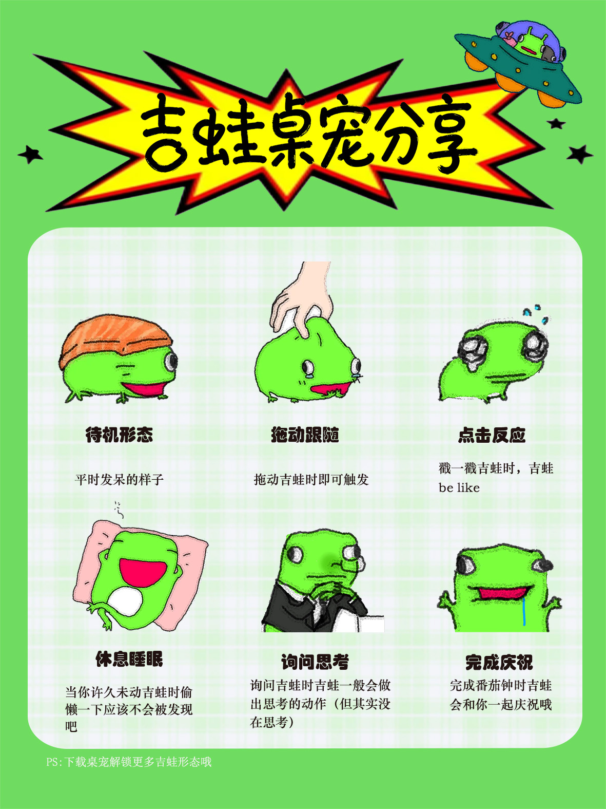

# 审美吉蛙桌宠

一只常驻桌面的吉蛙：既能摸鱼陪伴，也能干点正事。

<p align="center"></p>

> 免安装版（朋友直接用）：https://github.com/bekeke1228/aesthetic-frog-pet/releases/latest

## 下载与运行（给朋友 / 普通用户）
- 请下载页面右侧 **Releases** 里的 `审美吉蛙桌宠-3.3.0-win.zip`（免安装便携版）。
- 先**完整解压整个文件夹**，再双击里面的 `审美吉蛙桌宠.exe` 运行；不要在压缩包内直接双击，也不要只把单个 exe 拷走。
- 本仓库是**源码版**，需要先执行 `pnpm install` 才能用 `启动桌宠.bat` 启动，仅适合开发者/喜欢折腾的人。

## 功能

- **陪伴**：待机 / 睡觉 / 点击反应 / 拖拽 / 庆祝 / 说话六种动画状态；随机躺平吐槽；空闲 90 秒自动睡觉。
- **番茄钟**：默认 25 分钟工作 + 5 分钟休息，可配置；完成时吉蛙庆祝 + 系统通知 + 提示音；统计当日番茄数。
- **待办清单**：添加、勾选完成、删除、清空已完成，本地持久化。
- **喝水 / 久坐提醒**：默认每 45 分钟 / 60 分钟提醒一次（吉蛙气泡 + 系统通知 + 提示音），可暂停。
- **和吉蛙对话**：点吉蛙窗口右上角 💬（或按 T），直接在桌面提问；面板「问吉蛙」同样可用。
- **天气查询**：问「xx天气」等会实时联网查当前气温和天气（Open-Meteo，无需 Key）。
- **AI 问答（可选）**：面板设置里选择服务商（OpenAI / DeepSeek / 自定义），填入对应 API Key 后打开「AI 问答」，吉蛙会用 AI 认真回答问题；点「测试连接」可立即验证是否连通。DeepSeek 选 DeepSeek 即可（接口地址与模型会自动填好）。调用失败会自动退回本地蛙脑，并在设置里显示失败原因（本地蛙脑兜底；Key 明文保存在本地配置文件中）。
- **亲密度**：陪伴越久关系越好——陌生叫「人类」，满 2 小时称你为「老大」，满 24 小时成为「挚友」。
- **托盘常驻**：显示/隐藏、番茄钟控制、提醒开关、打开面板、退出；支持开机自启。

## 运行

最简单的方式：双击项目根目录的 **`启动桌宠.bat`**。

```bash
pnpm install
pnpm start
```


## 操作

- 左键按住拖拽：移动吉蛙（位置会被记住）
- 单击：吉蛙吐槽
- 双击或右键：打开面板（番茄钟 / 待办 / 提醒 / 设置）
- 右键菜单与托盘菜单相同


## 数据位置

配置、待办、番茄统计和窗口位置保存在 Electron 用户数据目录的 `store.json`：
`C:\Users\<你>\AppData\Roaming\aesthetic-frog-pet\store.json`

## 常见问题

- **透明窗口不生效**：确认系统为 Windows 10/11，并开启桌面合成（Aero）。
- **双击没反应**：打开任务管理器，结束所有 `electron.exe` 进程后再双击 `启动桌宠.bat`。
- **首次运行没有声音**：检查面板「设置 → 提示音」是否开启；若仍未播放，尝试把系统默认输出设备切换为扬声器。
- **想彻底移除**：托盘菜单 → 退出；若设置了开机自启，先在面板关闭。
